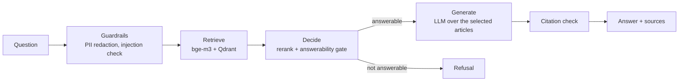

# legal-rag

[](https://github.com/ahmedsh711/legal-rag/actions/workflows/ci.yml)


Question answering over the Egyptian Civil Code, in Arabic and English, with article citations.

You ask a legal question. The service finds the relevant articles, decides whether they actually answer the question, and only then asks an LLM to write an answer grounded in those articles. Every answer cites its sources as `[Art. N]`. Questions the Civil Code does not cover get a refusal instead of a guess.

```bash
curl -s http://127.0.0.1:8000/ask -H 'content-type: application/json' \
  -d '{"question": "At what age does a person reach majority under the Civil Code?"}'
```

```json
{
  "answer": "A person reaches the age of majority at twenty-one years completed in accordance with the Gregorian calendar [Art. 44].",
  "language": "en",
  "sources": [
    {"article_number": 44, "citation": "Egyptian Civil Code, Article 44", "citation_ar": "القانون المدني المصري، المادة 44", "is_repealed": false}
  ],
  "refused": false,
  "guardrails": [],
  "model": "gemini-3.1-flash-lite"
}
```

The full response also carries `request_id`, `prompt_version`, token `usage` and per-stage `timings_ms`.

## How it works



1. **Ingestion.** The bilingual Civil Code PDF (170 pages) is parsed into one record per article: 1,149 articles, 1,093 in force and 56 repealed, each with its Arabic and English text and its book, chapter and section. Quirks of the source (reversed Arabic digits, mixed-language blocks, articles split across pages) are handled in the parser and checked by a validation stage in the DVC pipeline.
2. **Indexing.** Every article is embedded in both languages with [BAAI/bge-m3](https://huggingface.co/BAAI/bge-m3) (dense and sparse vectors) and stored in Qdrant: 2,241 points behind an alias, so a rebuilt index can be swapped in without downtime.
3. **Retrieval.** Articles the question names explicitly ("Article 60") are fetched directly, repealed ones included. Everything else goes through dense search over both languages, limited to articles in force.
4. **Decision.** A small decision model, [Jev](https://docs.typesafe.ai), scores each retrieved article and decides whether the top articles can answer the question at all. It costs about $0.0001 per question and replaces an LLM call for ranking and refusing. A local cross-encoder (`bge-reranker-v2-m3`) can be used instead, with no external calls.
5. **Generation.** Gemini, any OpenRouter model, or a self-hosted vLLM server writes the answer from the selected articles only. An answer that cites none of the articles it was shown is replaced by the refusal.

## Results

Measured on a hand-written golden set of 56 questions: 28 Arabic/English pairs, including off-topic and prompt-injection questions. The set is small and was also used to choose the gate threshold, so the numbers are indicative; a held-out set of 5 new pairs gave the same picture.

| Configuration | hit@1 | MRR | Citation recall | False refusals | Correct refusals |
|---|---|---|---|---|---|
| Hybrid retrieval, no reranking | 0.792 | 0.878 | 0.979 | 0 % | 100 % |
| **Dense retrieval + Jev (production)** | **1.000** | **1.000** | **1.000** | 0 % | 100 % |
| Same retrieval, Qwen2.5-1.5B (AWQ) on vLLM | 1.000 | 1.000 | 0.063 | 90 % | 100 % |

- RAGAS faithfulness is 0.97 for the production configuration (Arabic 0.98, English 0.96). The judge is from the same model family as the generator, so treat it as a sanity check rather than an independent score.
- The 1.5B model states the right facts but rarely follows the citation format, so the citation check turns most of its answers into refusals. Production generation stays on Gemini; vLLM is the self-hosted fallback.
- Guardrails block 34 of 40 injection attempts. The 6 obfuscated ones (base64, spaced letters, paraphrases) get past the pattern layer; in an end-to-end test the prompt rules and the citation check still refused 5 of them, and none produced the injected output. There are no false positives on 62 real questions or on the 2,241 article texts, and the check takes about 55 µs per question.

Serving on an RTX 3050 laptop GPU (4 GB), Qwen2.5-1.5B-Instruct-AWQ on vLLM handles 3.4 requests/s at 8 concurrent requests, with a 0.5 s median time to first token. A Locust ramp to 40 users showed the query embedder as the bottleneck. Batching concurrent queries into one embedding call raised throughput by 68 % and cut `/ask` p95 from 5.3 s to 1.9 s.

## Tech stack

| Area | Tools |
|---|---|
| API | FastAPI, Pydantic, structlog, Server-Sent Events |
| Retrieval | bge-m3, Qdrant, Jev |
| Generation | Gemini / OpenRouter through an OpenAI-compatible client, vLLM |
| Data and experiments | DVC, MLflow tracking and model registry, RAGAS |
| Platform | Docker Compose, Redis, Postgres, MinIO |
| Observability | Prometheus, Alertmanager, Grafana, Loki, Grafana Alloy, Langfuse |
| Quality | pytest, ruff, pre-commit, GitHub Actions, Locust |

## Getting started

### Prerequisites

- Docker with Compose v2
- [uv](https://docs.astral.sh/uv/), which installs Python 3.12 and the dependencies
- An API key for generation (Gemini or OpenRouter) and an OpenRouter key for the Jev decider
- The Civil Code PDF at `data/raw/egyptian_civil_code.pdf`, or `uv run dvc pull` if you have access to the DVC remote
- Optional: an NVIDIA GPU with at least 4 GB of memory for the vLLM profile

### Run

```bash
cp .env.example .env          # fill in the API keys
uv sync

docker compose --env-file .env -f docker/compose.yaml --profile core up -d   # Qdrant, Redis, API
uv run dvc repro                                                             # parse, validate, embed, index
curl -s http://127.0.0.1:8000/health
```

The first `dvc repro` embeds the corpus on CPU, which takes 10 to 30 minutes on a laptop; later runs reuse the existing index in seconds. The API container downloads bge-m3 on its first start and reports healthy once the index is reachable. Interactive API docs are served at http://127.0.0.1:8000/docs.

On Windows, use `127.0.0.1` instead of `localhost`, and send Arabic questions from a UTF-8 file (`curl --data-binary @question.json`) or from Python, because Git Bash passes inline arguments through the ANSI code page.

### API

| Endpoint | Description |
|---|---|
| `POST /ask` | `{"question": "...", "book": null}` returns the answer, sources, refusal flag, guardrails that fired, token usage and per-stage timings. `?stream=true` streams tokens as Server-Sent Events. Rate-limited per API key or IP (`429` with `Retry-After`). |
| `POST /feedback` | `{"request_id": "...", "rating": "up" \| "down", "comment": "..."}` |
| `GET /health` | Readiness: 200 only when the index is reachable and not empty |
| `GET /live` | Liveness |
| `GET /metadata` | Versions of the app, prompt, models, index and decider being served |
| `GET /metrics` | Prometheus metrics |

### Configuration

Settings are environment variables, read by `src/legalrag/settings.py`; `.env.example` lists all of them. The main ones:

| Variable | Purpose |
|---|---|
| `LLM_BACKEND` | `gemini`, `openrouter` or `vllm` |
| `DECIDER_BACKEND` | `jev`, `local` or `none` |
| `GATE_THRESHOLD` | minimum answerability score before the LLM is called (0.5 in production) |
| `CONFIG_SOURCE` | `env`, or `mlflow` to load the pipeline configuration from the registry alias `legal-rag-config@production` |
| `RATE_LIMIT_PER_MINUTE`, `RATE_LIMIT_BURST`, `API_KEYS` | per-client token bucket |
| `LANGFUSE_HOST`, `LANGFUSE_PUBLIC_KEY`, `LANGFUSE_SECRET_KEY` | tracing and prompt management (optional) |

### Compose profiles

| Profile | Services |
|---|---|
| `core` | Qdrant, Redis, API |
| `tracking` | Postgres, MinIO, MLflow (http://127.0.0.1:5000) |
| `llm` | vLLM serving Qwen2.5-1.5B-Instruct-AWQ; combine with `-f docker/compose.vllm.yaml` to point the API at it |
| `monitoring` | Prometheus, Alertmanager, Grafana (http://127.0.0.1:3001), Loki, Alloy, exporters, drift job |
| `llm-observability` | Langfuse (http://127.0.0.1:3000) with ClickHouse |

## Evaluation and experiments

Every evaluation run is logged to MLflow with its configuration, metrics per language and lineage tags: git commit, data hash, index collection and golden-set hash.

```bash
docker compose --env-file .env -f docker/compose.yaml --profile core --profile tracking up -d
uv sync --group eval

uv run python -m legalrag.eval.run --name dense-jev --decider jev --mode dense --retrieval-only --mlflow
uv run python -m legalrag.eval.run --name e2e-dense-jev --decider jev --mode dense --gate 0.5 --ragas --mlflow
uv run python -m legalrag.eval.track register --run-id <run-id> --alias production
uv run python -m legalrag.eval.guardrails_eval
uv run python -m legalrag.eval.llm_bench --name vllm --levels 1 4 8 16
```

With `CONFIG_SOURCE=mlflow`, the API loads the configuration registered under the `production` alias at startup. Promoting or rolling back a configuration is an alias change, not a rebuild.

## Monitoring

- **Metrics.** The API exports request rates, latency histograms per endpoint and per pipeline stage, time to first token, refusals, guardrail hits, decider verdicts, token usage and cost. Label values come from fixed lists, so the number of series stays bounded.
- **Dashboards and alerts.** Grafana dashboards and Prometheus rules are provisioned from `monitoring/`. User-facing symptoms (API down, p95 above the 5 s SLO, error-budget burn) page; causes (slow retrieval, vLLM queue, KV cache, token budget, drift, stale batch jobs) open tickets. The alert rules have promtool unit tests that run in CI.
- **Logs and traces.** JSON logs are shipped to Loki. Each request is one Langfuse trace with a span per stage, token usage and cost, and every log line carries the trace id. The system prompt is served from Langfuse by label: a rollback reaches the API in about a minute without a redeploy, and promoting a new prompt requires a passing quality-gate result for that exact text.
- **Drift.** Each answer writes a prediction event that contains no question text (language, length, retrieved book, refusal, scores). A scheduled job compares the last window with a reference using χ², Kolmogorov-Smirnov, MMD and a domain classifier, with a Bonferroni correction and a minimum effect size, and reports input, retrieval and behaviour drift separately.

```bash
docker compose --env-file .env -f docker/compose.yaml --profile core --profile monitoring --profile llm-observability up -d
uv run --group monitoring python -m legalrag.monitoring.drift_job run --hours 24
```

## Development

```bash
uv sync
uv run pre-commit install
uv run ruff check . && uv run ruff format --check .
uv run pytest            # unit and integration tests; fails below 80 % coverage
```

CI (`.github/workflows/ci.yml`) runs lint, tests, Prometheus and Alertmanager config checks, a RAGAS quality gate on 10 frozen questions (faithfulness ≥ 0.75, gold citations ≥ 0.8, and it fails if the judge cannot score the answers), and a Docker image build. On `main` the image is pushed to Docker Hub as `sha-<commit>` and `latest`.

Load test:

```bash
uv run --group load python -m locust -f loadtest/locustfile.py --headless \
  -u 40 -r 5 -t 8m --host http://127.0.0.1:8000
```

## Project structure

```
src/legalrag/
  ingest/          PDF parsing, Arabic normalisation, validation
  index/           embedding, Qdrant collections, query batching
  decider/         Jev and local reranking and answerability gate
  api/             FastAPI app, schemas, middleware
  eval/            golden-set runs, RAGAS, judge calibration, quality gate, benchmarks
  observability/   Prometheus metrics, Langfuse tracing and prompts
  monitoring/      prediction events, drift statistics, drift job, online evaluation
  pipeline.py      guard -> retrieve -> decide -> generate
tests/             unit and integration tests
data/golden/       evaluation and guardrail test sets
docker/            Dockerfile and Compose files
monitoring/        Prometheus, Alertmanager, Grafana and Loki configuration
loadtest/          Locust scenario and analysis scripts
dvc.yaml           data pipeline: parse -> validate -> index
```

## Limitations

- The golden set is small (28 question pairs) and was written by the author. It catches regressions; it does not prove general accuracy.
- PII redaction covers national IDs, phone numbers and email addresses, not names or street addresses.
- Article numbers quoted inside Arabic article bodies keep the digit order produced by PDF extraction. Citations always come from the parsed article numbers, so they are not affected.
- The drift reference is built from evaluation traffic. A real deployment should use a window of known-good production traffic.

## Acknowledgements

Built as the capstone project of the ITI × MLOps MENA *MLOps Practitioner* program (LLM/RAG track). The decide-then-generate design follows the JEV-RAG pattern.
