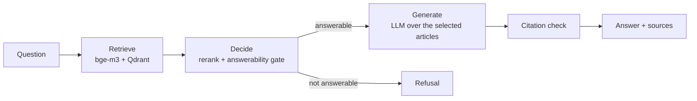

# legal-rag

[](https://github.com/ahmedsh711/legal-rag/actions/workflows/ci.yml)


Question answering over the Egyptian Civil Code, in Arabic and English, with article citations.

You ask a legal question. The service finds the relevant articles, decides whether they actually answer the question, and only then asks an LLM to write an answer grounded in those articles. Every answer cites its sources as `[Art. N]`. Questions the Civil Code does not cover get a refusal instead of a guess.

```bash
curl -s http://127.0.0.1:8000/ask -H 'content-type: application/json' \
  -d '{"question": "At what age does a person reach majority under the Civil Code?"}'
```

```json
{
  "answer": "A person reaches the age of majority at twenty-one years completed in accordance with the Gregorian calendar [Art. 44].",
  "language": "en",
  "sources": [
    {"article_number": 44, "citation": "Egyptian Civil Code, Article 44", "citation_ar": "القانون المدني المصري، المادة 44", "is_repealed": false}
  ],
  "refused": false,
  "model": "gemini-3.1-flash-lite"
}
```

The full response also carries `request_id`, `prompt_version`, token `usage` and per-stage `timings_ms`.

## How it works



1. **Ingestion.** The bilingual Civil Code PDF (170 pages) is parsed into one record per article: 1,149 articles, 1,093 in force and 56 repealed, each with its Arabic and English text and its book, chapter and section. Quirks of the source (reversed Arabic digits, mixed-language blocks, articles split across pages) are handled in the parser and checked by a validation stage in the DVC pipeline.
2. **Indexing.** Every article is embedded in both languages with [BAAI/bge-m3](https://huggingface.co/BAAI/bge-m3) (dense and sparse vectors) and stored in Qdrant: 2,241 points behind an alias, so a rebuilt index can be swapped in without downtime.
3. **Retrieval.** Articles the question names explicitly ("Article 60") are fetched directly, repealed ones included. Everything else goes through dense search over both languages, limited to articles in force.
4. **Decision.** A small decision model, [Jev](https://docs.typesafe.ai), scores each retrieved article and decides whether the top articles can answer the question at all. It costs about $0.0001 per question and replaces an LLM call for ranking and refusing. A local cross-encoder (`bge-reranker-v2-m3`) can be used instead, with no external calls.
5. **Generation.** Gemini or any OpenRouter model writes the answer from the selected articles only. An answer that cites none of the articles it was shown is replaced by the refusal.

## Results

Measured on a hand-written golden set of 56 questions: 28 Arabic/English pairs, including off-topic and prompt-injection questions. The set is small and was also used to choose the gate threshold, so the numbers are indicative; a held-out set of 5 new pairs gave the same picture.

| Configuration | hit@1 | MRR | Citation recall | False refusals | Correct refusals |
|---|---|---|---|---|---|
| Hybrid retrieval, no reranking | 0.792 | 0.878 | 0.979 | 0 % | 100 % |
| **Dense retrieval + Jev (production)** | **1.000** | **1.000** | **1.000** | 0 % | 100 % |

- RAGAS faithfulness is 0.97 for the production configuration (Arabic 0.98, English 0.96). The judge is from the same model family as the generator, so treat it as a sanity check rather than an independent score.

## Tech stack

| Area | Tools |
|---|---|
| API | FastAPI, Pydantic, structlog, Server-Sent Events |
| Retrieval | bge-m3, Qdrant, Jev |
| Generation | Gemini / OpenRouter through an OpenAI-compatible client |
| Data and experiments | DVC, MLflow tracking and model registry, RAGAS |
| Platform | Docker Compose, Postgres, MinIO |
| Quality | pytest, ruff, pre-commit, GitHub Actions |

## Getting started

### Prerequisites

- Docker with Compose v2
- [uv](https://docs.astral.sh/uv/), which installs Python 3.12 and the dependencies
- An API key for generation (Gemini or OpenRouter) and an OpenRouter key for the Jev decider
- The Civil Code PDF at `data/raw/egyptian_civil_code.pdf`, or `uv run dvc pull` if you have access to the DVC remote

### Run

```bash
cp .env.example .env          # fill in the API keys
uv sync

docker compose --env-file .env -f docker/compose.yaml --profile core up -d   # Qdrant and the API
uv run dvc repro                                                             # parse, validate, embed, index
curl -s http://127.0.0.1:8000/health
```

The first `dvc repro` embeds the corpus on CPU, which takes 10 to 30 minutes on a laptop; later runs reuse the existing index in seconds. The API container downloads bge-m3 on its first start and reports healthy once the index is reachable. Interactive API docs are served at http://127.0.0.1:8000/docs.

On Windows, use `127.0.0.1` instead of `localhost`, and send Arabic questions from a UTF-8 file (`curl --data-binary @question.json`) or from Python, because Git Bash passes inline arguments through the ANSI code page.

### API

| Endpoint | Description |
|---|---|
| `POST /ask` | `{"question": "...", "book": null}` returns the answer, sources, refusal flag, token usage and per-stage timings. `?stream=true` streams tokens as Server-Sent Events. |
| `POST /feedback` | `{"request_id": "...", "rating": "up" \| "down", "comment": "..."}` |
| `GET /health` | Readiness: 200 only when the index is reachable and not empty |
| `GET /live` | Liveness |
| `GET /metadata` | Versions of the app, prompt, models, index and decider being served |

### Configuration

Settings are environment variables, read by `src/legalrag/settings.py`; `.env.example` lists all of them. The main ones:

| Variable | Purpose |
|---|---|
| `LLM_BACKEND` | `gemini`, `openrouter` or `vllm` |
| `DECIDER_BACKEND` | `jev`, `local` or `none` |
| `GATE_THRESHOLD` | minimum answerability score before the LLM is called (0.5 in production) |
| `CONFIG_SOURCE` | `env`, or `mlflow` to load the pipeline configuration from the registry alias `legal-rag-config@production` |

### Compose profiles

| Profile | Services |
|---|---|
| `core` | Qdrant, API |
| `tracking` | Postgres, MinIO, MLflow (http://127.0.0.1:5000) |

## Evaluation and experiments

Every evaluation run is logged to MLflow with its configuration, metrics per language and lineage tags: git commit, data hash, index collection and golden-set hash.

```bash
docker compose --env-file .env -f docker/compose.yaml --profile core --profile tracking up -d
uv sync --group eval

uv run python -m legalrag.eval.run --name dense-jev --decider jev --mode dense --retrieval-only --mlflow
uv run python -m legalrag.eval.run --name e2e-dense-jev --decider jev --mode dense --gate 0.5 --ragas --mlflow
uv run python -m legalrag.eval.track register --run-id <run-id> --alias production
```

With `CONFIG_SOURCE=mlflow`, the API loads the configuration registered under the `production` alias at startup. Promoting or rolling back a configuration is an alias change, not a rebuild.

## Development

```bash
uv sync
uv run pre-commit install
uv run ruff check . && uv run ruff format --check .
uv run pytest            # unit and integration tests; fails below 80 % coverage
```

CI (`.github/workflows/ci.yml`) runs lint and the test suite on every push and pull request.

## Project structure

```
src/legalrag/
  ingest/          PDF parsing, Arabic normalisation, validation
  index/           embedding and Qdrant collections
  decider/         Jev and local reranking and answerability gate
  api/             FastAPI app, schemas, middleware
  eval/            golden-set runs, RAGAS, judge calibration, MLflow tracking
  pipeline.py      retrieve -> decide -> generate
tests/             unit and integration tests
data/golden/       evaluation sets
docker/            Dockerfile and Compose files
dvc.yaml           data pipeline: parse -> validate -> index
```

## Limitations

- The golden set is small (28 question pairs) and was written by the author. It catches regressions; it does not prove general accuracy.
- Article numbers quoted inside Arabic article bodies keep the digit order produced by PDF extraction. Citations always come from the parsed article numbers, so they are not affected.

## Acknowledgements

Built as the capstone project of the ITI × MLOps MENA *MLOps Practitioner* program (LLM/RAG track). The decide-then-generate design follows the JEV-RAG pattern.
